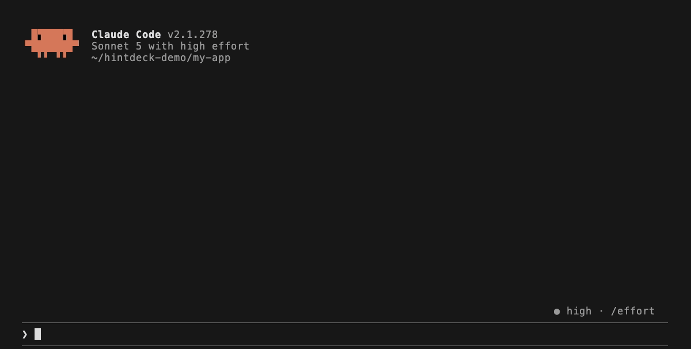
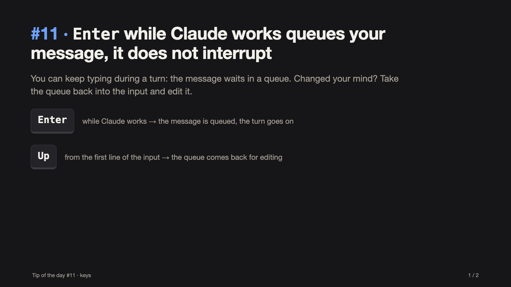
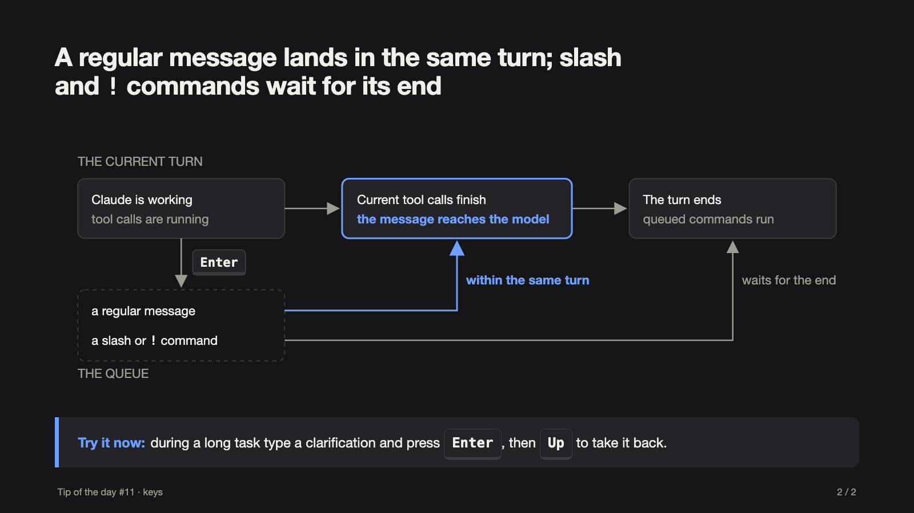

# hintdeck

**Tip of the day for [Claude Code](https://code.claude.com/docs)** — a deck of doc-verified tips you draw from one at a time. Never the same tip twice, picked for what you are doing right now.

Claude Code ships features faster than anyone reads changelogs. hintdeck turns the documentation into a habit: type `/tip`, learn one thing, try it in a minute.

<p align="center">
  
</p>

## What is inside

| Skill | What it does |
|---|---|
| `tip` | One tip per call: keyboard shortcuts, slash commands, CLI flags, context and memory, settings and hooks, skills/subagents/MCP, parallel work, ways of working, recent additions. |
| `tip-slides` | The same tip as a deck of 1–5 slides. A visual is added only when it answers a concrete question — which keys to press, in what order things happen, how the options differ. No decoration. |

<p align="center">
  
  
</p>

`/tip-slides 11` — a two-slide deck: the keys to press, then a flow showing *when* a queued message reaches the model, the one thing the text alone does not show. A tip that is a single fact gets a single slide and no diagram.

- **147 tips**, each verified against the official documentation and stamped with the CLI version it was checked on.
- **No repeats, one at a time** — enforced by a script, not by the model's memory.
- **Context-aware** — tips about things you already use (a status line, hooks, auto mode…) are skipped, tips that don't apply (worktrees outside a git repository, features newer than your CLI) are hidden, and the rest are matched to your current session.
- **Permanent numbers** — every tip has a number you can refer to and ask for again: `/tip 42`.
- **Multilingual** — English by default, Russian available: `/tip lang ru`.

## Install

As a plugin:

```
/plugin marketplace add PavelSozonov/hintdeck
/plugin install hintdeck@hintdeck
```

The skills are then `/hintdeck:tip` and `/hintdeck:tip-slides` — typing `/tip` and pressing `Tab` is enough.

As personal skills with the short names `/tip` and `/tip-slides`:

```bash
git clone https://github.com/PavelSozonov/hintdeck ~/.claude/hintdeck-src
ln -s ~/.claude/hintdeck-src/plugins/hintdeck/skills/tip        ~/.claude/skills/tip
ln -s ~/.claude/hintdeck-src/plugins/hintdeck/skills/tip-slides ~/.claude/skills/tip-slides
```

Requirements: `bash`, `awk`, `curl` (for `refresh` only). Tested on macOS with the system bash 3.2.

## Usage

| Call | Result |
|---|---|
| `/tip` | a new tip picked for the current session |
| `/tip hooks`, `/tip keys` | a new tip on a topic |
| `/tip 42` | tip #42 — including one you have already seen |
| `/tip history` | the tips shown so far, with numbers and dates |
| `/tip lang ru` | switch the tip language (`/tip lang` shows it, `/tip lang auto` forgets the choice) |
| `/tip refresh` | pull in new features from the changelog and re-check stale tips |
| `/tip-slides`, `/tip-slides <topic>`, `/tip-slides 42` | the same, as slides |

Topics: `keys` `commands` `cli` `context` `config` `extend` `parallel` `practices` `new`.

### Language

Tips come in English unless you choose otherwise. The language is resolved in this order: the `HINTDECK_LANG` environment variable, your saved choice (`/tip lang <code>`), Claude Code's own [`language` setting](https://code.claude.com/docs/en/settings-reference#language), then English. Your system locale never switches the language — at most the skill mentions once that another language is available. Switching keeps your history: ids and numbers are shared across languages.

## How it works

- **The script is the source of truth.** On every call the skill receives a single-use ticket and the list of unseen tips from `tip.sh`. `take` prints one tip, marks it as shown and burns the ticket — a second tip or a repeat is refused.
- **Filtering.** `skip-if` hides tips about features you already use, `needs` hides tips that don't apply to your environment, `since` hides features newer than your installed CLI. The model picks from what is left by looking at your session.
- **State** lives outside the repository in `~/.claude/hintdeck/` (shown history, language, local slide decks), so plugin updates never lose it. `tip` and `tip-slides` share it.
- **Verified facts only.** A tip enters the catalog when the docs (`https://code.claude.com/docs/en/*.md`), the changelog or `claude --help` confirm it. When answering, the model adds nothing "from memory".

Details: [`DESIGN.md`](plugins/hintdeck/skills/tip/DESIGN.md). Catalog maintenance: [`REFRESH.md`](plugins/hintdeck/skills/tip/REFRESH.md).

## Contributing

New tips and translations are welcome.

- A tip is a section in `decks/claude-code/en/<topic>.md` with a `verified:` metadata line and a `**Try it:**` line; the format is in [`REFRESH.md`](plugins/hintdeck/skills/tip/REFRESH.md). Link the primary source in the pull request — tips without one are not accepted.
- A translation is the same id in `decks/claude-code/<lang>/<topic>.md`. A new language is a new directory; untranslated tips fall back to English.
- The demo in `docs/demo/` is a recording of a real session; `docs/demo/make-gif.sh` re-records it.
- Before opening a pull request run `plugins/hintdeck/skills/tip/tip.sh number && plugins/hintdeck/skills/tip/tip.sh lint` and `claude plugin validate .`.

## License

[MIT](LICENSE)
